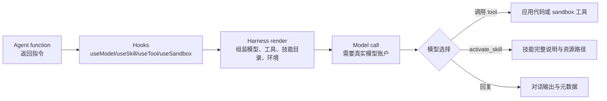

# 第 1 章：Agent-native harness

## 学习问题

很多自动化系统像一条固定流水线：先读取输入，再调用几个函数，最后输出结果。Flue 要教你的第一件事是另一种组织方式：**agent function 每一轮重新声明模型、工具、技能、sandbox、状态和提示，harness 再把这些声明变成模型能看见、能调用、能持久化的运行面**。如果把它误解成“一个脚本按顺序跑完”，你会把 skill、tool 和 sandbox 的边界混在一起。

## 学习目标与前置

完成本章后，你应该能：

1. 说明 agent function、agent hooks、harness、skill catalog 和 sandbox 各自负责什么。
2. 追踪一个 `SKILL.md` 从静态导入到 `useSkill(...)` 挂载，再到模型通过 `activate_skill` 读取完整说明的路径。
3. 区分静态配置事实和必须依赖 live model 的运行时事实。

前置知识：能阅读 TypeScript import、函数调用和简单 hook；知道本课程只使用固定快照，不把未执行命令当作通过记录。

## 从脚本流水线到 agent-native harness

固定脚本流水线的控制流通常写死在代码里：

```text
input -> parse -> call API -> format output
```

Agent-native harness 则把“能力声明”和“模型决策”分开。Flue 文档把 agent 描述为 LLM、harness 和 specialized context 的组合；agent function 返回系统提示，hook 声明能力，harness 负责把这些声明渲染给模型并处理后续工具调用、状态和对话。



图里最重要的分界线是：`useSkill(...)`、`useTool(...)`、`useSandbox(...)` 是代码声明；模型是否调用 `activate_skill`、是否调用某个 tool，是运行时行为。没有真实模型调用，不能声称“模型已经激活了某个技能”。

## Worked example：追踪 imported skill

固定版示例 `examples/imported-skill/src/agents/with-imported-skill.ts` 的核心片段很短：

```ts
'use agent';
import { useModel, useSkill, useTool } from '@flue/runtime';
import review from '../skills/review/SKILL.md';

export function WithImportedSkill() {
  useModel('anthropic/claude-haiku-4-5');
  useSkill(review);
  useTool({
    name: 'run-review-skill',
    description: 'Run the imported `review` skill and return its answer.',
    harness: true,
    async run({ harness }) {
      const response = await harness.prompt(
        `Use the "${review.name}" skill and report its result.`,
      );
      return { output: { text: response.text, reference: review.name } };
    },
  });
  return 'When asked to run the demo, call the `run-review-skill` action and report its result.';
}
```

逐行看：

- `'use agent'` 让构建过程把这个模块里的导出 agent 注册为可寻址的 agent。
- `import review from '../skills/review/SKILL.md'` 是静态导入。固定版 skills guide 说明：导入 `SKILL.md` 会在构建时验证 frontmatter，并把整个 skill 目录打包。
- `useModel(...)` 声明本 agent 使用的模型。源码 `use-model.ts` 说明 agent render 必须且只能声明一个模型。
- `useSkill(review)` 把导入的 skill reference 挂到当前 render 的 skill catalog。`use-skill.ts` 的注释解释了 progressive disclosure：模型一开始只看见 name 和 description；完整说明通过 `activate_skill` 工具结果到达。
- `useTool(...)` 声明一个 model-callable tool。这里设置 `harness: true`，所以 tool 的 `run` 函数能使用 `harness.prompt(...)` 开一个 scratch model operation。

这个例子适合 Builder 做路径追踪：`SKILL.md` 文件不是工作区里随手复制给模型的文本，而是先被静态导入，再由 `useSkill` 挂载。它也适合 Architect 看边界：skill 的出现只说明“模型可按需读取说明”，不说明 shell、文件系统或凭据已经开放。

## 静态配置、模型行为与资源边界

| 你能从固定源码确认 | 仍需要 live runtime 才能确认 |
| --- | --- |
| agent function 写了哪些 hook | 模型是否真的调用了某个 tool |
| `SKILL.md` frontmatter 是否满足静态规则 | 模型是否正确理解并应用 skill |
| `useSandbox(local())` 出现在代码里 | 命令是否在某台机器上实际成功 |
| eval 文件包含哪些断言 | eval 是否在某次运行中通过 |

Builder 提示：做代码追踪时，把“能从源文件直接读到的事实”和“必须运行才能看到的事件”分两列。Architect 提示：评审时不要用“技能可用”替代“权限已授予”；skill、tool、sandbox 是三种不同边界。

## 常见误解

| 误解 | 纠正 |
| --- | --- |
| agent 就是一段按顺序跑完的脚本 | Flue agent function 每轮 render，hook 重新声明能力，模型在运行时选择动作。 |
| `useSkill` 会把完整 skill 内容永久塞进 system prompt | 固定版说明是 progressive disclosure：catalog 里常驻的是 name 与 description，完整内容在激活后作为 tool result 返回。 |
| 有 skill 就有文件和 shell 权限 | 文件和 shell 来自 sandbox。没有 sandbox，内置文件/命令工具不会出现。 |
| 子代理可以自己换 sandbox | `use-sandbox.ts` 明确限制 subagent render 中不能调用 `useSandbox()`；delegates 共享父 agent 环境。 |

## 本章小结

Flue 的 harness 不是“替你执行一串固定步骤”的脚本包装器，而是一个把 agent function 的静态声明、模型可见资源、工具调用、对话持久化和环境边界连接起来的运行层。你读源码时，先找 agent function 和 hook；你评审设计时，先问 skill、tool、sandbox、state 各自在哪里声明、在哪里生效。

## 自查题

1. `useSkill(review)` 已经出现在源码里，这能不能证明模型已经读过 `review` 的完整说明？  
   提示：区分 catalog 挂载与 `activate_skill` 工具调用。
2. 为什么 `harness.prompt(...)` 仍然需要谨慎描述为运行时行为？  
   提示：它会发起模型操作；没有执行证据就不能说它成功。
3. 如果一个 agent 没有调用 `useSandbox()`，你能期待它拥有 `bash` 和文件工具吗？  
   提示：回到 sandboxes guide 的“What a sandbox adds”。

## 参考与下一步

- `apps/docs/src/content/docs/guide/building-agents.md`
- `apps/docs/src/content/docs/guide/agent-hooks.md`
- `apps/docs/src/content/docs/guide/skills.md`
- `packages/runtime/src/hooks/use-skill.ts`
- `packages/runtime/src/hooks/use-sandbox.ts`
- `examples/imported-skill/src/agents/with-imported-skill.ts`

下一章：[Skills and context](./02-skills-and-context.md)。
