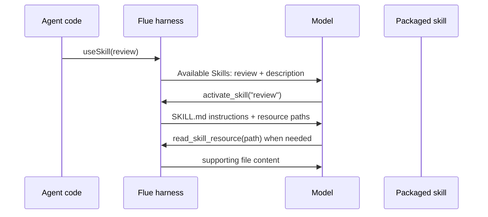

# 第 2 章：Skills and context

## 学习问题

当团队说“给 agent 加一个技能”时，常见误解有两个：一是把 skill 当成可执行 tool；二是把 skill directory 当成普通 Markdown 文件夹。固定版 Flue 的设计更细：skill 是可逐步披露的教学包，frontmatter 决定它能否被识别，supporting files 随包走但按需读取，workspace skills 与 imported skills 的生命周期也不同。

## 学习目标与前置

完成本章后，你应该能：

1. 写出合规 `SKILL.md` 的核心 frontmatter 规则。
2. 解释 imported/mounted skill、inline `defineSkill(...)` 和 workspace skill 的区别。
3. 说明 progressive disclosure 为什么节省上下文，但不等于授予 tool 或 shell 权限。
4. 处理旧 README 与当前 guide/source 的差异，而不发明运行结果。

前置知识：会编辑 Markdown frontmatter；能阅读第 1 章的 `useSkill(...)` 路径。

## Skill directory 是一个教学包

固定版 skills guide 给出的目录形态是：

```text
src/skills/refunds/
├─ SKILL.md
└─ POLICY.md
```

`SKILL.md` 的 frontmatter 包含 skill 的 name 与 description，正文是完整说明；目录里的其他文件成为 supporting files。关键点是：supporting files 不会自动塞进模型上下文。对 imported skill，构建时会打包整个目录；运行时激活 briefing 会列出资源路径，模型需要时再读取。对 workspace skill，文件留在 workspace，激活时从磁盘读取。

## Frontmatter 规则：小字段，大后果

固定版 `skill-frontmatter.ts` 与 skills guide 支持以下规则：

| 字段 | 规则 |
| --- | --- |
| `name` | 必填；小写 ASCII 字母、数字、连字符；不以前后连字符开头结尾；不含连续连字符；最多 64 字符；必须匹配目录名。 |
| `description` | 必填；非空；最多 1024 字符；用于模型判断何时激活。 |
| `license` | 可选；信息性字段。 |
| `compatibility` | 可选；最多 500 字符；信息性字段。 |
| `metadata` | 可选；string-to-string mapping；Flue 不解释。 |
| `allowed-tools` | 可选；接受但不强制执行。 |
| 未知字段 | 固定版 Flue 忽略；更严格的外部 validator 可能报告。 |

Builder 要把这张表转成检查清单：目录名和 `name` 不一致，会让 imported skill 在构建期失败。Architect 要记住：`allowed-tools` 被接受不代表平台真的按它收缩工具集；工具集仍由 harness、sandbox 和应用授权决定。

## Worked example：修复一个坏 skill

假设目录是 `src/skills/review/`，但文件写成：

```markdown
---
name: ReviewSkill
description:
---

Read CHECKLIST.txt before answering.
```

修复版本应类似：

```markdown
---
name: review
description: Reviews an answer using packaged supporting guidance.
---

Read `CHECKLIST.txt`, then answer using that checklist.
```

逐项解释：

- `ReviewSkill` 不符合 lowercase/hyphen 规则，也不匹配目录名 `review`。
- 空 `description` 不能帮助模型路由，也会被 frontmatter 规则拒绝。
- `CHECKLIST.txt` 可以继续作为 supporting file 留在同一目录；它不需要放进 frontmatter，也不需要复制到 sandbox。

固定版 imported-skill 示例中的真实 `review/SKILL.md` 就采用了 `name: review` 与一行 description；`CHECKLIST.txt` 内容很短，用来提醒“direct, accurate, and complete”。

## Progressive disclosure：可发现，不是全量常驻



这就是 progressive disclosure 的学习价值：模型先看到足够路由的信息，只有在任务匹配时才加载完整说明和 supporting files。它减少上下文成本，也让技能内容保持只读包语义。

## Imported、inline、workspace skills

| 类型 | 适合场景 | 关键边界 |
| --- | --- | --- |
| 静态 imported skill | 应用随构建分发的技能包 | `SKILL.md` 静态导入，严格验证并打包目录。 |
| `defineSkill(...)` inline skill | 内容短、由代码组装或从普通 Markdown 转换 | 定义会验证并冻结；可带 `files` map。 |
| Workspace skill | workspace 自带约定或仓库知识 | 从 `<cwd>/.agents/skills/` 发现；坏文件跳过并警告；内容从 workspace 读取。 |

## 旧 README 与当前 pinned source 的差异

固定版 `examples/imported-skill/README.md` 仍提到较旧的 wording，例如 `{ type: 'skill'}`、`session.skill(review)` 和 `skills: [review]`。同一固定快照下，current skills guide、`use-skill.ts` 和 `with-imported-skill.ts` 展示的是 `import review from '../skills/review/SKILL.md'` 后用 `useSkill(review)` 挂载，再由 `activate_skill` 激活。

学习时不要把旧 README 直接升级成当前运行事实。更稳妥的说法是：“这个 README 保留了旧契约表述；本教材采用同一快照中的 current guide 与 hook/source 示例来讲解当前路径。是否存在兼容行为，需另有运行或维护者证据。”

## 常见误解

| 误解 | 纠正 |
| --- | --- |
| description 是给人看的长摘要 | 它是模型常驻看到的路由信息，要同时说明能力和触发条件。 |
| supporting file 会自动进入 prompt | 它保持惰性；模型需要读取时才加载。 |
| `allowed-tools` 能保证权限收缩 | 固定版说明为接受但不强制执行。权限边界要看 tool/sandbox/应用授权。 |
| workspace skill 与 imported skill 失败方式一样 | imported skill 构建期严格失败；workspace skill malformed 时跳过并警告。 |

## 本章小结

Skill 是“可被模型按需加载的教学包”，不是可执行函数，也不是 sandbox 权限声明。Builder 应该把 frontmatter 和目录结构修到能被严格验证；Architect 应该把旧文档冲突、授权边界和 progressive disclosure 的成本收益写进设计决策。

## 当前公开文档交叉核验

本课程另通过 WebIQ 在 2026-09-11 获取了 Flue 公共官方仓库 `main` 分支的 skills guide。检索到的正文继续支持本章的关键边界：skill 采用 progressive disclosure；`useSkill(...)` 挂载后由 `activate_skill` 激活；workspace skill 从 `.agents/skills/` 发现；`allowed-tools` 被接受但不由 Flue 强制执行。页面正文标记 `lastReviewedAt: 2026-07-21`，而提供方只给出抓取时间、没有 `lastUpdatedAt`。因此这是一条“检索时公开页面如此表述”的补充证据，不替代固定 commit，也不证明模型或 runtime 行为。

## 自查题

1. 为什么 `name` 必须匹配目录名？  
   提示：模型 catalog、打包和资源定位都需要稳定标识。
2. 一个 skill 写了 `allowed-tools: bash`，是否证明模型只有 bash 可用？  
   提示：回到字段说明“accepted, not enforced”。
3. 面对旧 README 与当前 source 冲突，你的 ADR 应记录什么？  
   提示：保留冲突来源、说明采用当前 guide/source 的原因、列出需要运行验证的缺口。

## 参考与下一步

- `apps/docs/src/content/docs/guide/skills.md`
- `packages/runtime/src/skill-frontmatter.ts`
- `packages/runtime/src/hooks/use-skill.ts`
- `examples/imported-skill/README.md`
- `examples/imported-skill/src/agents/with-imported-skill.ts`
- `examples/imported-skill/src/skills/review/SKILL.md`

下一章：[Tools and sandboxes](./03-tools-and-sandboxes.md)。
