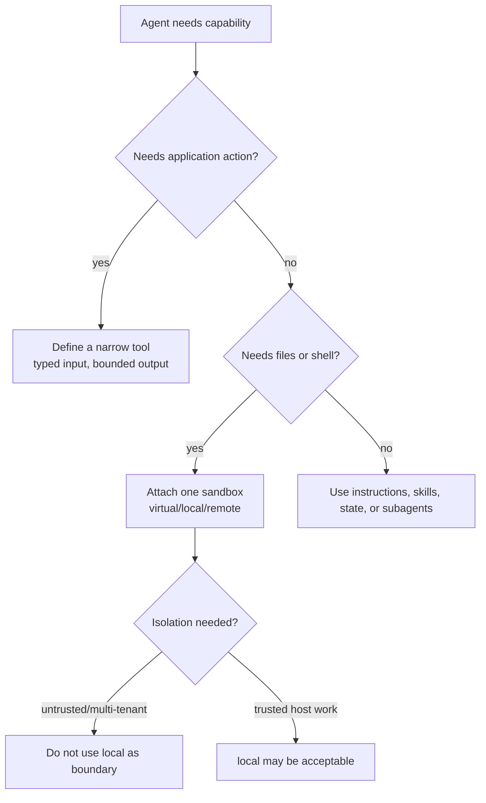

# 第 3 章：Tools and sandboxes

## 学习问题

当 agent 需要“做事”时，你要先问两个问题：它需要的是一个 **tool**，还是一个 **sandbox**？tool 是应用代码暴露给模型的受控动作；sandbox 是文件系统和命令执行环境。混淆这两者会带来危险判断：例如把 `local()` 当作隔离边界，或以为 virtual sandbox 能运行真实原生编译。

## 学习目标与前置

完成本章后，你应该能：

1. 解释 `defineTool(...)`/`useTool(...)` 如何暴露 typed tool。
2. 比较 virtual、local、remote sandbox 的能力、限制与风险。
3. 为“原生进程需求、隔离需求、长期远程工作区需求”三类场景写出 why/why not。
4. 写一则小 ADR，说明最小必要能力与取消/生命周期责任。

前置知识：TypeScript 基础、JSON schema 或 Valibot schema 的概念；已读第 1 章关于 `useSandbox()` 的边界。

## Tool：模型可调用的应用动作

固定版 tools guide 展示的 tool definition 包含 `name`、`description`、可选 `input` schema、可选 `output` schema 和 `run`。`defineTool(...)` 会验证定义并返回冻结对象；`useTool(...)` 把它挂到当前 render 的工具集。

```ts
import { defineTool } from '@flue/runtime';
import * as v from 'valibot';

export const lookupOrder = defineTool({
  name: 'lookup_order',
  description: 'Look up one order by id and return its current status.',
  input: v.object({ orderId: v.string() }),
  async run({ data }) {
    const order = await orders.get(data.orderId);
    return { output: { status: order.status, eta: order.eta } };
  },
});
```

代码走读：

- `input` 必须是 Valibot 的顶层 object schema；模型给的参数先被验证，失败时 `run` 不执行。
- `description` 是模型理解何时调用的主要说明，不能写得含糊。
- `run` 返回 `{ output: ... }` 这样的 envelope；抛错会作为 tool error 返回给模型，而不是悄悄吞掉。
- 如果 tool 需要 agent 的环境或 scratch model operation，才设置 `harness: true`；否则它只是输入到输出的应用函数。

## Sandbox：文件与命令环境

Sandbox 决定 agent 是否拥有文件和 shell 工具。固定版 sandboxes guide 明确说，没有 sandbox 时，没有内置文件/命令工具，也没有 workspace context；`harness.sandbox` 会失败。



## 三类 sandbox 对比

| Sandbox | 固定版描述 | 适合 | 不适合 |
| --- | --- | --- | --- |
| virtual | in-memory filesystem + emulated bash from `just-bash`; no real process spawned; network must be explicitly allowed | scratch text/data reshaping、`curl`/`jq` 类轻量任务 | 原生编译、真实进程、持久文件、未经允许的网络 |
| local | Node target 下绑定宿主机真实文件系统和 shell；没有隔离 | 受信任开发工具、CI、专用 VM/容器内的 coding agent | 不可信请求、多租户隔离、把宿主凭据交给模型 |
| remote | provider-managed sandbox adapter；应用创建、复用、删除 provider 资源；可按 instance id 连接持久 workspace | 每对话隔离、完整 Linux 工具链、长期远程工作区 | 生命周期无人负责、取消语义未设计、成本/配额不可控 |

### local() 不是隔离

固定版 local sandbox 说明非常直接：`local()` 绑定宿主机，文件操作使用真实文件系统，`bash` 通过宿主 shell 运行真实进程，**there is no isolation**。它默认只传一小组 shell essentials，额外环境变量必须显式 opt-in。把 `{ ...process.env }` 全量传入会把 secrets 交给模型指挥的 shell；教材中不这样示范。

### virtual 不能运行真实原生进程

Virtual sandbox 的优点是轻、隔离、内存文件系统；代价是它的 shell 是 TypeScript 中的 emulated bash，不会 spawn real process。Builder 不应把它用于“编译本地原生扩展”；Architect 不应把它写成“完整 Linux 隔离环境”。

### remote 的生命周期属于应用方

Remote adapter 很适合“每个 conversation 一个隔离工作区”。但固定版 sandboxes guide 也说明：Flue 只连接你交给它的 provider sandbox，不负责销毁 provider 基础设施。取消命令时，本地 process group 可被真正停止；多数 provider SDK 没有 mid-flight cancellation，远程命令可能继续跑，只是结果被丢弃。治理上必须设计创建、复用、取消和清理策略。

## Scenario worked example：三场景选择

| 场景 | 推荐 | 为什么 | 不选理由 |
| --- | --- | --- | --- |
| Builder 要让 agent 运行真实 `pnpm test` 和本机工具链 | `local()`，但只在受信任专用工作区或 CI 容器内 | 需要真实进程和已有工具链 | virtual 不 spawn 进程；remote 成本高且需 adapter。 |
| 平台接收多租户不可信代码片段，只需文本处理和 allowlisted HTTP | virtual 或专门 remote | virtual 能隔离宿主且网络可 allowlist；更强需求用 remote | local 不是隔离；未经设计的 remote 可能遗留资源。 |
| 团队需要每个 issue 一个可恢复的远程 Linux 工作区 | remote adapter | 可按 instance id 连接 durable provider workspace | virtual ephemeral；local 共享宿主且难治理；必须补清理和取消策略。 |

## ADR 练习

写一则短 ADR：

```text
Decision: 对不可信请求不使用 local()。
Context: 请求来自多个租户，需要防止读取宿主文件和环境变量。
Options: virtual / local / remote。
Decision: 首版使用 virtual，只开放 allowlisted HTTP；需要真实编译时升级到 remote。
Consequences: 不能运行原生编译；需把持久结果写入应用数据库；未来 remote adapter 必须定义取消与清理。
```

Builder 可把 ADR 中的“不能运行原生编译”转成测试计划；Architect 可把“取消与清理”转成运维责任。

## 常见误解

| 误解 | 纠正 |
| --- | --- |
| tool schema 是授权边界 | schema 只验证模型参数。授权应由应用代码绑定客户、仓库、token 或目标。 |
| sandbox 越强越好 | 选择最小必要环境；扩大 sandbox 就扩大模型可读、可写、可执行范围。 |
| remote 取消一定杀掉远程命令 | 固定版说明多数 provider SDK 可能只是让 prompt 拒绝并丢弃结果。 |
| subagent 可以另选 sandbox | subagents 共享父 agent 环境；只能用 task call 的 cwd 缩小工作目录。 |

## 本章小结

Tool 是应用动作，sandbox 是执行环境；二者都要按最小必要能力设计。`local()` 适合受信任宿主工作，不是隔离边界；virtual 适合轻量、内存、无真实进程任务；remote 适合强隔离和持久远程工作区，但生命周期和取消责任不能省略。

## 自查题

1. 如果模型只需要查询一个订单状态，为什么 narrow tool 比开放 shell 更合适？  
   提示：比较参数范围、授权绑定和审计。
2. 为什么 virtual sandbox 适合 `curl`/`jq` 类任务，却不适合 native compile？  
   提示：看 “No real process is ever spawned”。
3. remote sandbox 的清理责任属于谁？  
   提示：Flue 连接 provider sandbox；应用创建、复用、删除 provider 资源。

## 参考与下一步

- `apps/docs/src/content/docs/guide/tools.md`
- `apps/docs/src/content/docs/guide/sandboxes.md`
- `packages/runtime/src/tool.ts`
- `packages/runtime/src/hooks/use-tool.ts`
- `packages/runtime/src/hooks/use-sandbox.ts`

下一章：[Evaluation and observability](./04-evaluation-and-observability.md)。
