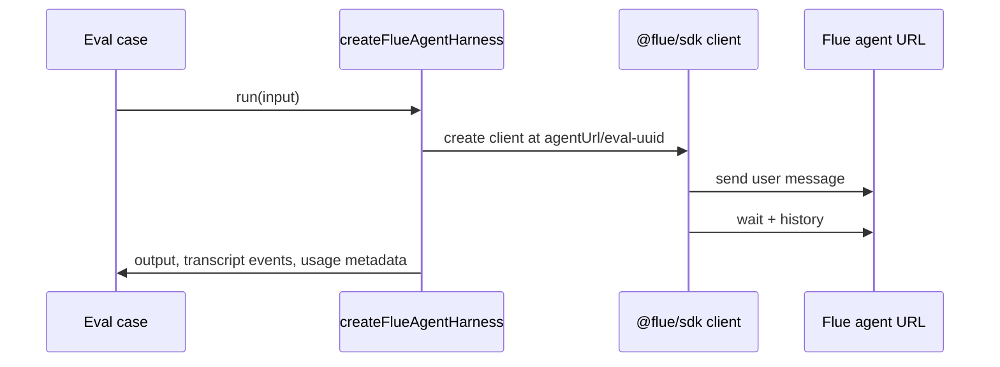

# 第 4 章：Evaluation and observability

## 学习问题

Agent 质量不能只靠“我觉得回答不错”。但反过来，看到一个 eval 示例文件，也不能说“课程已经证明它通过”。本章教你把静态 eval 资产、可运行前置条件、真实运行结果和学习成效分开：**评估 agent 行为需要证据，证明学习者学会了也需要另一类证据**。

## 学习目标与前置

完成本章后，你应该能：

1. 解释固定版 `vitest-evals` 示例的结构：README、config、harness、eval case。
2. 区分 deterministic checks、model judge、trace/event inspection 和 objective outcome。
3. 写出 live eval preflight note，明确凭据、server、URL 和运行边界。
4. 不把静态示例、README 命令或未执行的模型调用写成通过记录。

前置知识：知道 Vitest 是测试运行器；能阅读基本 TypeScript async 函数；如果选择后续 L5，需要自己的模型账户和目标环境授权。

## 评估什么：行为质量，不是课程疗效

对 agent 的评估通常看：

- 是否调用了应该调用的 tool。
- 是否给出符合业务规则的回答。
- 是否保留必要引用或拒绝越权请求。
- token usage、tool events、trace 是否支持判断。

这些能证明“agent 在某些输入下表现如何”。它们不能直接证明“学习者已经掌握课程目标”。学习者成效要看学习产物，例如图示、ADR、preflight note 和自查答案。

## 固定版 vitest-evals 示例结构

固定版 `examples/vitest-evals/README.md` 描述了一个 HTTP-exposed Flue agent 的 eval 流程：先准备模型凭据并启动 Flue server，再在另一个终端运行 eval；也可以把 `FLUE_AGENT_URL` 指向已部署应用的 agent mount URL。这里的关键是：README 命令是静态说明，不是本教材作者执行过的记录。

`vitest.evals.config.ts` 负责把 eval 文件纳入 Vitest：

```ts
export default defineConfig({
  test: {
    include: ['src/evals/**/*.eval.ts'],
    reporters: ['default', 'vitest-evals/reporter'],
    testTimeout: 60_000,
  },
});
```

走读：

- `include` 只收集 `src/evals/**/*.eval.ts`，说明 eval 与普通单元测试可以用不同 config 管理。
- `vitest-evals/reporter` 让评估输出进入专门 reporter。
- `testTimeout: 60_000` 反映这是可能等待 agent/server/model 的测试，不等于一定会在任何机器上通过。

## Harness worked example：从 conversation 变成 eval result

`src/evals/harness.ts` 的核心逻辑是：用 `@flue/sdk` 对每个 case 创建一个 fresh conversation，发送输入，等待完成，读取 history，再把 message、tool call、tool result 和 usage metadata 转成 `vitest-evals` 结果。



这个图适合 Builder 看“怎样把 agent 对话转成测试结果”。Architect 则应注意：agent URL、token、headers 和 server 生命周期属于环境前置条件；教材不能替学习者授权或启动真实服务目标。

## Service health eval：能静态读到什么

`service-health.eval.ts` 中的断言包括：

- `result.output` 包含 `"operational"`。
- tool calls 中包含 `get_service_status`。
- `result.usage.totalTokens` 大于 0。

这些断言体现了三种信号：文本输出、tool trace、usage metadata。它们比“回答看起来对”更可检查。但在本课程当前范围内，这只是固定版静态证据：没有启动 server、没有发送真实模型请求、没有得到通过日志。

## Deterministic checks 与 model judges

| 方法 | 适合 | 风险 |
| --- | --- | --- |
| 确定性断言 | 检查字段、工具名、状态码、必含文本、schema | 可能过度关注表面字符串 |
| Trace/event inspection | 检查是否调用关键工具、是否产生 usage metadata | 需要可靠事件转换和日志保留 |
| Model judge | 评价开放式回答质量、事实性、语气 | judge 本身也需校准，不能替代源证据 |
| Objective outcome | 看任务是否真的完成，如文件生成、工单状态变化 | 可能需要授权环境和清理策略 |

实践建议：先写 deterministic checks 和 trace checks，因为它们最容易复查；开放式质量再加 model judge；真正副作用要放在受控、授权、可清理的环境里。

## Live eval preflight note 模板

在后续 L5 中，学习者可在自己的环境里执行真实 eval。执行前至少写清：

```text
目标 agent URL: <学习者自己的 agent mount URL>
模型账户: <学习者自备并授权>
服务状态: <server 已由学习者启动或部署>
凭据处理: <只在学习者授权环境使用，不写入教材>
数据范围: <eval case 输入和可访问系统>
清理计划: <会话、日志、临时资源如何处理>
静态依据: README/config/harness/eval 文件路径
真实结果: <运行后再填写；未运行时写 Not observed here>
```

注意这里不提供任何他人的私有凭据、私有配置文件或私有路径。可选实作需要学习者自己的授权。

## 常见误解

| 误解 | 纠正 |
| --- | --- |
| README 有命令就等于课程跑通过 | 命令是说明；通过需要执行证据。 |
| `expect(result.output).toContain(...)` 足够证明 agent 质量 | 它只是一个检查点，最好结合 tool trace、schema 和真实目标结果。 |
| usage metadata 一定存在 | harness 读取的是 agent 自己通过 `useResponseFinish` 放入 metadata 的约定；没写就可能没有。 |
| agent eval 通过证明教材有效 | agent 行为评估和学习者掌握程度是不同问题。 |

## 本章小结

好的评估说明要同时诚实和有用：告诉学习者静态文件如何组织、真实运行需要哪些前置条件、哪些断言能检查行为、哪些结论还没有被观察。Builder 可以把这些转成 preflight note；Architect 应把授权、环境、trace 保留和结果声明写成治理边界。

## 自查题

1. `service-health.eval.ts` 的三类信号分别是什么？  
   提示：文本、tool calls、usage。
2. 为什么本教材不能写“vitest-evals 已通过”？  
   提示：课程当前没有执行 server/model/eval。
3. 如果你用 model judge 评价开放式答案，还需要 deterministic checks 吗？  
   提示：judge 能评价质量，但不能替代硬性边界和 trace。

## 参考与下一步

- `examples/vitest-evals/README.md`
- `examples/vitest-evals/vitest.evals.config.ts`
- `examples/vitest-evals/src/evals/harness.ts`
- `examples/vitest-evals/src/evals/service-health.eval.ts`
- `apps/docs/src/content/docs/guide/tools.md`
- `apps/docs/src/content/docs/guide/agent-hooks.md`

下一步：回到 [教材首页](./README.md) 复查四章目标；然后进入 `../lab-manual/01-trace-an-agent.md`、`../lab-manual/02-build-a-skill.md`、`../lab-manual/03-choose-capability-boundaries.md`、`../lab-manual/optional/04-activate-and-observe.md`、`../lab-manual/optional/05-evaluate-an-agent.md` 完成 L1-L5。
